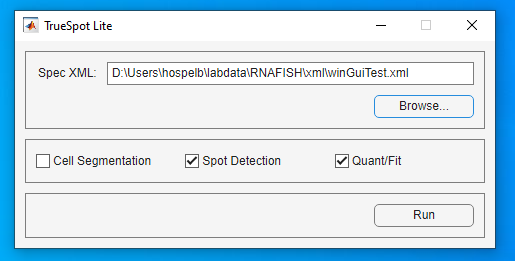

# TrueSpot
A MATLAB pipeline for automatically processing TIFF image stacks. Functions include cell segmentation, RNA/marker spot detection (with automatic thresholding), and RNA/marker quantification.

[Detailed Documentation](./doc/dochome.md) | [Benchmarking Data](https://github.com/neuertlab/TrueSpot-ReferenceData) | [Zenodo Repository](https://zenodo.org/records/13345321)

## Citations
**Cell Segmentation:** [View Paper](https://doi.org/10.1038/s41598-019-46689-5) | [Standalone](https://www.dropbox.com/sh/egb27tsgk6fpixf/AADaJ8DSjab_c0gU7N7ZF0Zba?dl=0)

Kesler, B.K., Li, G., Thiemicke, A., Venkat, R., Neuert, G. (2019). Automated cell boundary and 3D nuclear segmentation of cells in suspension. *Scientific Reports*, **9**(1).

**Local Maxima Detection:**

Hospelhorn, B.G., Kesler, B.K., Jashnsaz, H., Neuert, G. (2025). TrueSpot: A robust automated tool for quantifying signal puncta in fluorescent imaging. *Genome Biology*, In Revision.

**Spot & Cloud Quantification:** [View Paper](https://pubmed.ncbi.nlm.nih.gov/40328749/)

Kesler, B.K., Adams, J., Neuert, G. (2025). Transcriptional stochasticity reveals multiple mechanisms of long non-coding RNA regulation at the Xist-Tsix locus. *Nature Communications*, **16**(1):4223.

## Dependencies
[MATLAB 2022a (or higher)](https://www.mathworks.com/products/get-matlab.html?s_tid=gn_getml)

[MATLAB Image Processing Toolbox](https://www.mathworks.com/products/image-processing.html) | [MATLAB Signal Processing Toolbox](https://www.mathworks.com/products/signal.html) | [MATLAB Parallel Computing Toolbox](https://www.mathworks.com/products/parallel-computing.html)

[Java JRE 8 (or higher)](https://www.java.com/en/download/manual.jsp)

## Compatibility
Scripts/GUIs should run on any system with compatible versions of MATLAB and Java.

## Specification XMLs
As of version 1.2.0, paths and parameters may be specified using XML files instead of long command line options in some cases.

Two interfaces require XML inputs instead of shell commands:
* The TrueSpot Lite GUI
* The slurm batch generator script `scripts/tsBatchGen.py`

Example XMLs can be found in `doc/sampleXmls`, and documentation detailing recognized XML fields and structure can be found [here](./doc/pages/spec_xml_doc.md).

*XMLs are text files and thus can be viewed or edited using any text editing program such as Sublime or Notepad++*

## Usage - TrueSpot Lite GUI
As of version 1.3.0, TrueSpot provides a rudimentary GUI called **TrueSpot Lite** for desktop use.



### How to Run TrueSpot Lite
If there is no prebuilt release executable for your target system, simply double clicking on the `.sh` or `.bat` file appropriate for your OS should launch the GUI.

* Windows: `TrueSpotLite_Win.bat`
* MacOS: `TrueSpotLite_Mac.sh`
* Linux: `TrueSpotLite_Linux.sh`

The above TrueSpot Lite wrapper scripts invoke MATLAB via the command line, thus a valid installation of MATLAB and the Toolbox dependencies is required to run TrueSpot Lite in this way.

Alternatively, TrueSpot Lite can be launched directly from its MATLAB app file (`./src/gui/TrueSpotMinimal.mlapp`), either by double clicking the file from the system explorer or from inside the MATLAB desktop IDE. This method also requires a pre-existing MATLAB installation.

### Input
The TrueSpot Lite interface only accepts XML specifications as input. Full documentation for the XML structure and options can be found [here](./doc/pages/spec_xml_doc.md). 

### Test Example
A simple example input XML specifically designed for testing TrueSpot Lite can be found at `./doc/sampleXmls/TSLite_Test.xml`. To run this example as-is, the referenced test image must be downloaded and placed in `./testdata/Input` (you will need to make these folders in the repository base directory). Alternatively, the input test image path and TrueSpot output target can be changed by editing the `ImageDir` and `OutputDir` values in the sample XML directly.

### Use Cases
TrueSpot Lite is primarily intended for relatively small stacks and/or batches that can be processed on a common desktop workstation. There are two factors that must be considered when deciding whether to run TrueSpot locally or on a computing cluster.

* TrueSpot holds the stack it's working on in memory as a 3D matrix of `double` (ie. 8 bytes per voxel). Thus it can get very RAM hungry.
* The time required for spot detection to run is highly dependent on the size of the input stack and the number of thresholds scanned due to the poor performance scaling of `imregionalmax` - ranging from seconds to hours. 

This is due to the application of threshold filtering *before* regional maximum detection, requiring `imregionalmax` to be called for every tested threshold. The easiest way to speed up this process is to request more "threads" (though MATLAB appears to implement this via multiple separate processes) using the `Workers` attribute for a `SpotDetectSettings` element in the input specification. The test thresholds are distributed between the workers and the coordinate calls are saved to disk and recombined into a single table at the end. Therefore, 2 workers will effectively halve the processing time and 4 workers will quarter it. 
The flip side is that this time reduction will only occur if the system running TrueSpot has enough cores to run enough workers at the same time. It also increases memory usage as each worker makes temporary (smaller) copies of the stack to process. As such only relatively beefy computers will be able to take full advantage of this feature.

## Usage - Slurm Batch Generator Script
TrueSpot was originally designed to be deployed on a computing cluster to run large batches of large image stacks in parallel. Thus, we provide a python wrapper script (`./scripts/tsBatchGen.py`) that reads a TrueSpot parameter specification XML and generates the slurm commands and bash scripts to run one or more batches of tif stacks through TrueSpot.

`tsBatchGen.py` requires only one position argument - the XML path. It should be run on the filesystem that TrueSpot will be accessing as it scans the input directory for tifs and all paths it generates will be relative to what it is given.

```
python3 ${TRUESPOT_BASE_DIR}/scripts/tsBatchGen.py "${XMLPATH}"
```

There is an optional XML block called `JobSettings` that is recognized by `tsBatchGen.py` and ignored by TrueSpot Lite (see `,.doc/sampleXmls/batchSettings.xml`). This is used to specify memory, core count, and wall time. It is also used to give `tsBatchGen.py` the path to TrueSpot's repository root and pass a MATLAB module name for the `module load` command typically found on clusters.

If your cluster does not use slurm (sbatch) or module load, the output of `tsBatchGen.py` may not be compatible.

Notaby, `tsBatchGen.py` also requires python 3 to run.

## Usage - Command Line
This section covers basic usage commands for each module. Additional usage options are detailed in the documentation [here](./doc/dochome.md). We recommend using the wrapper bash scripts for Linux command line usage just to keep things clean, but direct usage for the MATLAB scripts will be outlined here as well.

You do not need to build anything - MATLAB is an interpreter/JIT compiling virtual environment. All you need to use these scripts is MATLAB.

### MATLAB Commmand Line
To run any scripts directly in MATLAB on the command line, you need to pass a script to MATLAB that also makes sure the directory containing the code is on its search path. Our wrapper scripts use the format:

```
matlab -nodisplay -nosplash -logfile [LogPath] -r "cd [TrueSpot Dir]; [MainFunctionName]('[Arg0]','[Arg1]',...'[Argn]'); quit;"
```

We recommend surrounding all arguments, even numerical arguments, with single quote marks just in case. The argument processors in the Main scripts know how to parse strings to the types they need.

Our bash wrapper scripts do not include any module loading due to the fact that module names and loading frameworks can vary between systems. Do not forget to module load MATLAB and all dependencies if running on such a system.

### Cell Segmentation
MATLAB Command Line Interface Script: `Main_CellSegConsole.m`

Bash Wrapper Script (Command Line): `TrueSpot_CellSeg.sh`

The only required argument is `-input`. See [documentation](./doc/pages/cellseg_allargs.md) for full argument list.

**Common Arguments** (Options are the same for both interfaces)
| Name | Parameter | Description |
| ----- | ----- | ----- |
| `-input` | *Path* - Path to input image file.  | The input image or image stack containing light/TRANS channel. |
| `-innuc` | *Path* - Path to image file.  | The input image stack containing the nuclear marker channel, if different from the main input stack. |
| `-chtotal` | *Integer* - Channel Count  | The total number of channels in the input image stack. (Default: 1) |
| `-chtotnuc` | *Integer* - Channel Count  | The total number of channels in the `innuc` image stack, if provided. (Default: 1) |
| `-chlight` | *Integer* - Channel Index (1-based) | The TRANS or passthrough light channel in the input image stack. Only used for background extraction along with cell segmentation mask. |
| `-chnuc` | *Integer* - Channel Index (1-based) | The nuclear stain (eg. DAPI) channel in the input image stack, or the `innuc` image stack if one is provided. (Default: 1) |
| `-outpath` | *Path* - Directory path | Path to directory to place output files. File names will be automatically generated from image name. (Default: Directory of input image.) |
| `-ocellmask` | *Path* - Path to image (tif) file output | Path to write rendered TIF of cell mask. (Default: None) |
| `-onucmask` | *Path* - Path to image (tif) file output | Path to write rendered TIF of nuclear mask. (Default: None) |
| `-osettings` | *Path* - Path to text file output | Path to write text file with run settings information. (Default: None.) |
| `-ovrw` | - | **Flag** - Overwrite any existing output. |
| `-dumpsummary` | - | **Flag** - Dump text file containing input parameter summary. |
| `-imgname` | *String* - Name | Name to assign to image and output files. Useful for images with long unwieldy file names. (Default: Input file name.) |
| `-template` | *String* - Template name | Name of preset template to use. |
| `-savetmpl` | *String* - Template name | Save settings for this run as a preset template with the specified name. |

### Local Maxima Detection
MATLAB Interface Script: `Main_RNASpots.m`

Bash Wrapper Script: `TrueSpot_RNASpots.sh`

The only required argument is `-input`. See [documentation](./doc/pages/spots_allargs.md) for full argument list.

**Common Arguments - Input/Output** (Options are the same for both interfaces)
| Argument | Parameter | Description |
| -------- | ----- | ----- |
| `-input` | *Path* - Path to input image file. | (Required) The input image or image stack. |
| `-ctrlimg` | *Path* - Path to control image file.  | A control image or image stack file. Only TIFF or MAT files are recognized at this time. |
| `-outstem` | *Path Stem* - Output path stem | Filename stem for output files including output directory. (Default: (Directory of input image)/(input image name)_(detection strategy) |
| `-csvout` | *Path* - Output file path | Path to output callset as a csv file. |
| `-runparamout` | *Path* - Output file path | Path dump run parameters to a plain text file. |
| `-csvzero` | - | **Flag** - Output csv table uses 0-based coordinates instead of MATLAB default 1-based coordinates. |
| `-csvthonly` | - | **Flag** - Output csv table contains only calls at or above the automatically called threshold. |

**Common Arguments - Channels**
| Argument | Parameter(s) | Description |
| ----- | ----- | ----- |
| `-chtotal` | *Integer* - Channel Count  | The total number of channels in the input image stack. (Default: 1) |
| `-chsamp` | *Integer* - Channel Index (1-based) | The channel in the input image stack to process as sample. (Default: 1) |

There are similar options for multi-channel control images.

**Common Arguments - Tuning**
| Argument | Parameter(s) | Description |
| ----- | ----- | ----- |
| `-thmin` | *Integer* - Threshold value | Minimum filtered intensity threshold value to scan, inclusive (Default: 10) |
| `-thmax` | *Integer* - Threshold value | Maximum filtered intensity threshold value to scan, inclusive (Default: 500) |
| `-autominth` | - | **Flag** - Determine threshold scan minimum automatically from image properties. |
| `-automaxth` | - | **Flag** - Determine threshold scan maximum automatically from image properties. |
| `-ztrim` | *Integer* - Z slice count | Number of Z slices to trim out from top and bottom of stack (Default: 0) |
| `-sensitivity` | *Integer* - Level (0-2) | Set thresholding parameters to preset reflecting desired level of sensitivity (Default: 0) |
| `-precision` | *Integer* - Level (0-2) | Set thresholding parameters to preset reflecting desired level of precision (Default: 0) |

Z trimming can also be applied by specifying the minimum and maximum slices.

**Common Arguments - Misc.**
| Argument | Parameter(s) | Description |
| ----- | ----- | ----- |
| `-imgname` | *String* - Name | Name to assign to image and output files. Useful for images with long unwieldy file names. (Default: Input file name.) |
| `-verbose` | - | **Flag** - Turn on default log verbosity. |
| `-quiet` | - | **Flag** - Minimize log output messages. |
| `-threads` | *Integer* - Thread number | Number of threads to request from MATLAB. As many threads may run in parallel as there are available cores. (Default: 1) |

### Spot & Cloud Quantification
MATLAB Interface Script: `Main_RNAQuant.m`

Bash Wrapper Script: `TrueSpot_RNAQuant.sh`

There are no individually required arguments, but some form of input (either an image or a spotsrun generated by the Spot Detect module) is required. See [documentation](./doc/pages/quant_allargs.md) for full argument list.

In most cases, as TrueSpot quant is typically run after TrueSpot spot detection, only `runinfo` is required.

**Common Arguments**
| Name | Parameter | Description |
| ----- | ----- | ----- |
| `-runinfo` | *Path* - Path to spots run info file  | MAT file (generally ending in "_rnaspotsrun.mat") produced by the Spot Detection module. Contains links and run parameters. |
| `-tif` | *Path* - Path to TIF image file  | File containing image/stack to be analyzed. (Default: Path stored in provided run info)|
| `-outdir` | *Path* - Output directory path  | Directory to place results files in (Default: Directory of primary input file)|
| `-cellsegpath` | *Path* - Path to cell mask  | File containing a 2D or 3D cell segmentation mask. Accepts CellSeg module MAT outputs, single channel TIF, and unheaded csv or tsv. |
| `-nucsegpath` | *Path* - Path to nucleus mask | File containing a 2D or 3D nuclear segmentation mask, if different from cell mask. Accepts CellSeg module MAT outputs, single channel TIF, and headerless csv or tsv. (Default: cellsegpath) |
| `-mthresh` | *Int* - Threshold value  | Threshold value to use to obtain starting calls (Default: Value stored in spotsrun) |
| `-zadj` | *Float* - Adjustment factor  | Ratio of distance between z-planes to xy pixel size. (Default: 1.0, or z/x ratio from runinfo voxel dimensions if stored) |
| `-norefilter` | - | **Flag** - Skip refiltering to rederive maxima list. If this flag is set, a coordinate table path is expected either directly or via the spotsrun. |
| `-nocells` | - | **Flag** - Evaluate input image as a whole instead of cell-by-cell. If this flag is set, cell segmentation paths are ignored. |
| `-noclouds` | - | **Flag** - Skip cloud detection and only do gaussian fitting. |

## Additional Scripts
TODO: idistro, QC, batch thresholds, and quant dump

## Contact

For questions or concerns please submit an issue via GitHub or contact the PI Gregor Neuert at gregor.neuert@vanderbilt.edu
