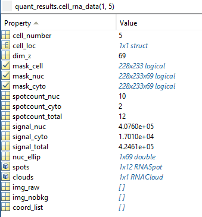

# Quantification Module - Output File Descriptions
This page describes the various output files generated by the quantification module.

[Back](../dochome.md)

## MAT Files
Files with the `.mat` extension are MATLAB data files. They are generally used to store variables/data from a workspace or program or whatnot on disc for use across sessions or systems. These files contain MATLAB data structures/variables as compressed binary data and cannot be read in a text editor. However, they are by design very easy to load and view in MATLAB. In the IDE GUI this is as simple as dragging and dropping the MAT file into the workspace panel on the right that lists environment variables. Programmatically, the built-in `load` and `save` functions are all that are needed to read and write these files.

TrueSpot outputs MAT files by default simply because they are smaller than text files with the same data and it makes parsing much easier for downstream modules. However, there are options for dumping output information to standard text tables as well.

## Standard Outputs
The quantification module outputs two files: the full results in a compressed MAT file (usually called `${OUTPUT_DIR)/${IMAGE_NAME}_quantData.mat`) and a per-cell summary csv (usually called `${OUTPUT_DIR)/${IMAGE_NAME}_quantResults.csv`).

### Quant Results csv
The results csv file is a simple table that can be opened in a text editor or Excel. Each row in the table is a cell (as specified by the cell mask). If a cell mask is not provided or the `-nocells` argument is used, the entire image will be treated as one "cell" and the csv file will only have one row.
The table includes the coordinates of the box encapsulating each cell, nuclear and cytoplasmic spot counts (for fitted spots) and integrated signal totals for cell, nucleus and cytoplasm.

### Quant Data MAT
The quantData file contains a single struct called `quant_results`. This is the struct produced by `RNAQuant.FitRNA`, the internal wrapper function for gaussian fitting and cloud detection. `quant_results` records the parameters used for the quantification run, in addition to some intermediate statistics (such as `plane_stats`). The spot fits and cloud information are held in `quant_results.cell_rna_data`.

Unlike with other TrueSpot result files, the relevant class definitions (`SingleCell`, `RNASpot`, and `RNACloud` - all can be found in the `core` directory) are required to load and read `cell_rna_data`. `cell_rna_data` is an array of `SingleCell`s, each representing a cell as marked by the input cell mask. The `SingleCell` contains the coordinates of the box encapsulating the cell, the masks for the individual cells, their nucleus and cytoplasm, signal calculations, per z-slice nucleus statistics, and details information for each fit spot and cloud.

`spots` contains an array of `RNASpot` objects - one for each gaussian fitted spot found in the cell. An `RNASpot` lists the seed coordinates (from the local maximum) and estimated fit volume on the top level, with fit details in `gauss_fit`. `gfit_slices` also contains the details of the 2D fit for each slice looked at for this spot (due to anisotropy and focus variability, xy gaussian fits are performed in 2D on individual slices and the z fit is done using another approach). Most coordinates are relative to the *cell* box boundaries though there are some z coordinates relative to the box drawn around the spot for fitting (generally the seed slice will be at the center of the box - so if the z radius is 2, then the seed slice will have an index of 3).

`clouds` is an array of `RNACloud` objects (though it will be empty if no sufficiently large clouds were detected in the cell). An `RNACloud` specifies the box around the cloud (coordinates relative to the cell), the cloud mask within that box, and the calculated volume and integrated intensity.
