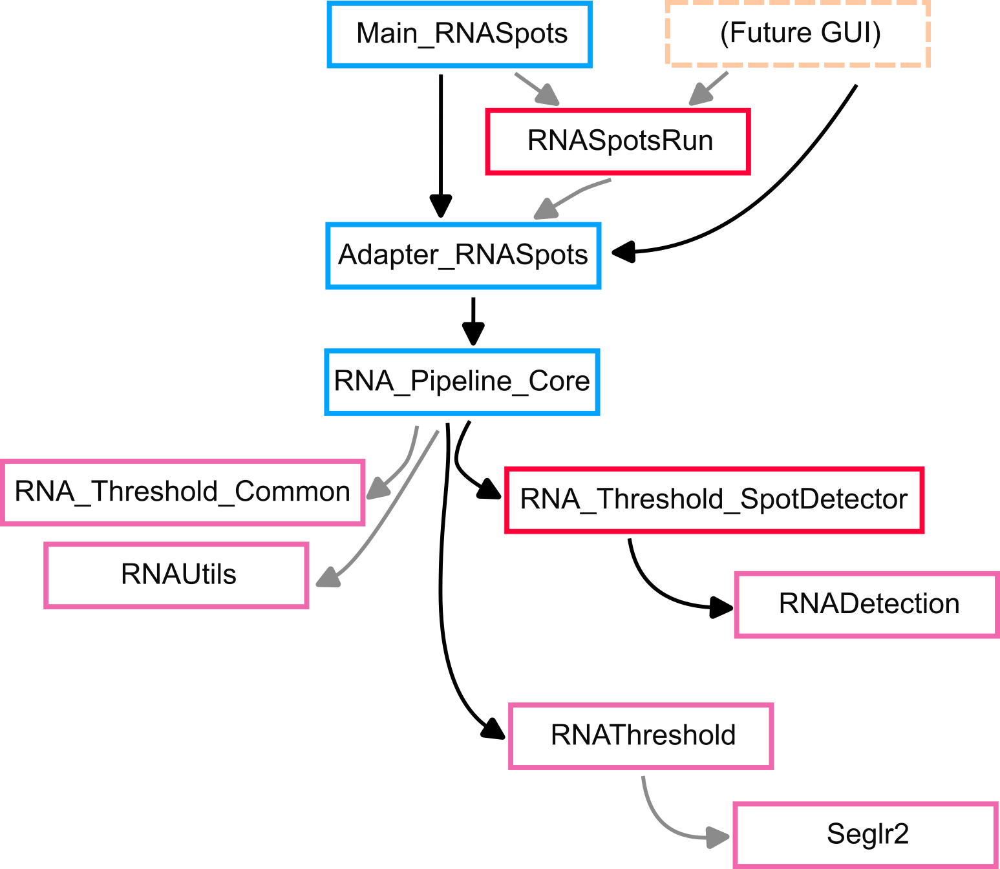

# Spot Detection Module - Internal Flow
This page provides a brief overview of the modules within the spot calling module. This is to make it slightly easier for anyone looking into the code to find functions of interest.

## Node Summaries
Below is a short description of each node in the general flow chart shown above.

**Main_RNASpots** - A MATLAB function file that deals with parsing arguments and storing them in a data structure that the pipeline core will accept. It also takes care of some "sanity checks".

**Adapter_RNASpots** - A MATLAB function file that primarily serves to funnel inputs from different user interfaces into the spot detect pipeline. It provides a few more sanity checks that may or may not be handled by the input interface. It was created in case a GUI was ever added in addition to the command line interface.

**RNASpotsRun** - An instantiatable class for storing parameters describing a spot detection run and some of its results. The definition used to be more strict with every parameter being assigned to its own instance variable, but besides being an issue for clutter, it made it harder to store and load an object's contents in a mat file in such a way that they could be easily read without the `RNASpotsRun.m` class definition.

**RNA_Pipeline_Core** - The core wrapper function that runs the actual spot detection and automated thresholding. It takes an instance of `RNASpotsRun` as its main argument. It can also accept input images that have been preloaded by another MATLAB script, as would be useful in a GUI.

**RNA_Threshold_SpotDetector** - A class containing static wrapper functions for the spot detection process. Mostly left in for compatibility purposes. 

### RNADetection

### RNAThreshold

### Seglr2

### RNA_Threshold_Common

### RNAUtils